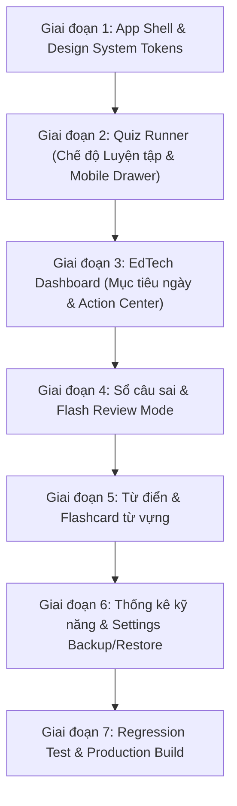

# UI/UX ROADMAP – EnglishQuiz Master 2026

Lộ trình triển khai nâng cấp giao diện, trải nghiệm người dùng và hệ thống tính năng học tập cho nền tảng ôn thi tiếng Anh THPT 2026.

---

## 1. DANH SÁCH TÍNH NĂNG & ĐỘ ƯU TIÊN

| STT | Tính năng nâng cấp | Ưu tiên | Lý do & Giá trị cho người học | Độ khó | File ảnh hưởng chính |
|:---:|---|:---:|---|:---:|---|
| **1** | **Chế độ Luyện tập vs Thi thử (Practice vs Exam Mode)** | **Must-Have (P0)** | Cho phép người học chọn xem ngay lời giải thích & bản dịch sau khi chọn đáp án (Practice) hoặc làm tính giờ nộp bài như thi thật (Exam). Giúp học nhanh, hiểu sâu ngay tại chỗ. | Trung bình | `src/components/QuizRunner.tsx`, `src/types/quiz.ts` |
| **2** | **Redesign Dashboard EdTech (Daily Goal & Smart Action)** | **Must-Have (P0)** | Biến Dashboard thành trung tâm học tập: Lời chào cá nhân, Mục tiêu ngày (e.g. 20 câu/ngày), Thẻ tiếp tục bài thi dở, Nút hành động nhanh, Thống kê chuỗi học 🔥. | Trung bình | `src/components/Dashboard.tsx`, `src/services/storageService.ts` |
| **3** | **Mobile Question Navigator (Bottom Sheet Drawer)** | **Must-Have (P0)** | Giúp màn hình làm bài trên mobile gọn gàng, không bị 40 câu hỏi che khuất nội dung đoạn văn, mở ra dạng Bottom Sheet trượt mượt mà. | Vừa phải | `src/components/QuizRunner.tsx`, `src/index.css` |
| **4** | **Tinh gọn & Nâng cấp Mobile Navigation Shell** | **Must-Have (P0)** | Thiết kế thanh Bottom Nav 5 tab chuẩn ngón tay cái (`Trang chủ`, `Kho đề`, `Sổ câu sai`, `Từ điển`, `Thống kê`) + Menu thao tác nhanh, chuẩn safe area. | Nhẹ | `src/components/Navbar.tsx`, `src/index.css` |
| **5** | **Flash Review Mode trong Sổ tay câu sai** | **Should-Have (P1)** | Học sinh có thể bấm "Ôn tập dạng thẻ" để lật từng câu sai, tự đánh giá "Đã hiểu" hoặc "Cần ôn lại" kèm âm thanh/hiệu ứng ghi nhớ. | Vừa phải | `src/components/MistakeNotebook.tsx` |
| **6** | **Nâng cấp Flashcard 3D & Học từ vựng** | **Should-Have (P1)** | Trải nghiệm lật thẻ từ vựng với phát âm Web Speech API, nghĩa tiếng Việt, câu ví dụ và thanh tiến trình hoàn thành. | Vừa phải | `src/pages/DictionaryPage.tsx` |
| **7** | **Trang Kết quả thông minh (Smart Result Insights)** | **Should-Have (P1)** | Hiển thị lời chúc mừng/động viên, tốc độ làm bài trung bình (giây/câu), phân tích năng lực theo chủ đề và nút tắt "Ôn ngay câu sai vừa làm". | Vừa phải | `src/components/QuizResult.tsx` |
| **8** | **Modal Cài đặt & Quản lý dữ liệu (Backup / Restore JSON)** | **Should-Have (P1)** | Cho phép học sinh tải về bản sao lưu tiến độ học tập (JSON) và nạp lại khi đổi máy/trình duyệt, tùy chỉnh chế độ làm bài mặc định. | Vừa phải | `src/components/SettingsModal.tsx`, `src/App.tsx` |
| **9** | **Trực quan hóa Phân tích kỹ năng (Skill Radar & Progress Bars)** | **Should-Have (P1)** | Biểu đồ thanh tiến độ tỷ lệ đúng theo 6 kỹ năng (Ngữ pháp, Từ vựng, Đọc hiểu, Điền từ, Sắp xếp, Giao tiếp) giúp học sinh biết chính xác lỗ hổng. | Vừa phải | `src/pages/HistoryStatsPage.tsx` |
| **10** | **Keyboard Shortcuts Hint & Accessibility Polish** | **Nice-to-Have (P2)** | Hiển thị huy hiệu phím tắt nhỏ (1, 2, 3, 4, F, Arrow keys) cạnh đáp án và điều hướng, hỗ trợ focus ring chuẩn WCAG 2.1 AA. | Nhẹ | `src/components/QuizRunner.tsx`, `src/index.css` |

---

## 2. KẾ HOẠCH TRIỂN KHAI THEO GIAI ĐOẠN

